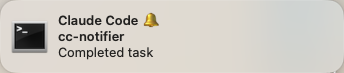
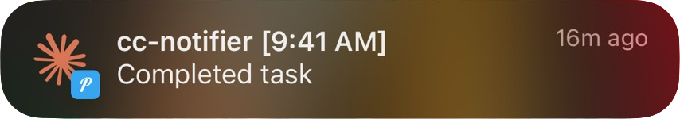

# cc-notifier 🔔

**Intelligent macOS and Phone/Push notifications for Claude Code. Local notifications bring you back to your original window with a single click**

Context-aware notifications that detect when you switch away and provide click-to-focus functionality when Claude Code completes tasks or needs input.

Push notifications intelligently notifies you when you're away from your computer.

## ✨ Features

- **🎯 Click-to-Focus** - Click the local notification to return to your original window across macOS Spaces
- **📲 Push Notifications (Optional)** - Intelligent push notifications for when you're away from your computer
- **🧠 Intelligent Detection** - Only notifies when you actually switch away (no spam when you're already focused)
- **⚡ Fast** - Runs asynchronously in the background, never slows down Claude Code execution
- **🪟 Cross-Space Window Focusing** - Works across multiple macOS Spaces using Hammerspoon
- **📝 Session-Smart** - Tracks each Claude Code session to avoid notification conflicts
- **🔧 Zero Configuration** - Works out of the box with reasonable defaults

Most notification systems only take you to the app, not the exact window you were working in, which isn't ideal when you have multiple IDE or terminal windows open.
- cc-notifier solves this by tracking the exact window you were using and restoring focus to it, even if it's in a different Space.

---

## 📋 Table of Contents

**Getting Started:**
- [🛠️ Requirements](#requirements) - What you need
- [⚙️ Installation](#installation) - Complete setup

**Configuration & Usage:**
- [🔧 Claude Code Configuration](#claude-code-configuration) - Full JSON config
- [📲 How Push Notifications Work](#how-push-notifications-work) - Advanced features

**Help & Development:**
- [💡 Troubleshooting](#troubleshooting) - Fix common issues
- [🧪 Development & Testing](#development--testing) - Contribute or customize
- [🏗️ How It Works](#how-it-works) - Technical details

## 📱 Examples

**Local macOS Notification** - Instant feedback with click-to-focus:



**Push Notification** - When you're away from your computer:



## 🛠️ Requirements

### Required Dependencies
- **macOS** - Any recent version
- **Python 3.9+** - Core implementation language (uses only standard library)
- **Hammerspoon** - For cross-space window focusing
  ```bash
  brew install --cask hammerspoon
  ```
- **terminal-notifier** - For macOS notifications
  ```bash
  brew install terminal-notifier
  ```

### Optional Dependencies
- **Pushover account** - For push notifications when away from computer
  - Sign up at [pushover.net](https://pushover.net)
  - No additional software installation required

### Optional Development Tools
Development dependencies are only needed for contributors and are managed via virtual environment:
- **ruff** - Modern Python linting and formatting
- **mypy** - Type checking for code quality
- **pytest** - Testing framework with coverage
- **pre-commit** - Git hook management

Install development tools:
```bash
python3 -m venv .venv
source .venv/bin/activate
make install
```

## ⚙️ Installation

### 1. Install Dependencies
```bash
# Install required tools
brew install --cask hammerspoon
brew install terminal-notifier
```

### 2. Install cc-notifier
```bash
# Clone and install
git clone https://github.com/Rendann/cc-notifier.git
cd cc-notifier
./install.sh
```

### 3. Configure Hammerspoon
After installing Hammerspoon, ensure these modules are loaded in your `~/.hammerspoon/init.lua`:

```lua
require("hs.ipc")
require("hs.window")
require("hs.window.filter")
require("hs.timer")
```

After adding these modules, restart Hammerspoon or reload the configuration:
```bash
# Reload Hammerspoon configuration (can also use the Hammerspoon GUI)
hs -c "hs.reload()"
```

These modules are essential for cc-notifier's cross-space window focusing functionality.

### 4. Configure Claude Code
Add the hook configuration to your `~/.claude/settings.json` - see [Claude Code Configuration](#-claude-code-configuration) for the complete JSON.

### 5. Start a new Claude Code session
Tell it to do something simple like "just say hi" then:
- Switch to another window before it responds, to see if local notifications work
- Step away from your computer to see if push notifications work (if configured)

**You should see a notification!** Click it to test the focus functionality.

**Want push notifications?** See [Claude Code Configuration](#-claude-code-configuration) to add Pushover credentials.

## 🔧 Claude Code Configuration
After installation, add this configuration to your Claude Code settings at `~/.claude/settings.json`:

**Basic configuration (local notifications only):**
```json
{
  "hooks": {
    "SessionStart": [
      {
        "matcher": "*",
        "hooks": [
          {
            "type": "command",
            "command": "$HOME/.cc-notifier/cc-notifier init"
          }
        ]
      }
    ],
    "Stop": [
      {
        "matcher": "*",
        "hooks": [
          {
            "type": "command",
            "command": "$HOME/.cc-notifier/cc-notifier notify"
          }
        ]
      }
    ],
    "Notification": [
      {
        "matcher": "*",
        "hooks": [
          {
            "type": "command",
            "command": "$HOME/.cc-notifier/cc-notifier notify"
          }
        ]
      }
    ],
    "SessionEnd": [
      {
        "matcher": "*",
        "hooks": [
          {
            "type": "command",
            "command": "$HOME/.cc-notifier/cc-notifier cleanup"
          }
        ]
      }
    ]
  }
}
```

**Optional: Add push notifications**
To enable push notifications, add environment variables to the same file. cc-notifier automatically detects when both `PUSHOVER_API_TOKEN` and `PUSHOVER_USER_KEY` are present and activates push notifications:

```json
{
  "env": {
    "PUSHOVER_API_TOKEN": "your_pushover_app_token",
    "PUSHOVER_USER_KEY": "your_pushover_user_key"
  },
  "hooks": {
    // ... same hooks configuration as above
  }
}
```

**Setting up Pushover credentials:**
1. Sign up at [pushover.net](https://pushover.net)
2. Create an application to get your app token
3. Note your user key from the dashboard
4. Add both keys to the `env` section of your Claude Code `settings.json` (as shown above)

**Alternative: Shell environment variables**
You can also set these as shell environment variables instead of in Claude Code settings:
```bash
# Add to ~/.zshrc, ~/.bashrc, or ~/.bash_profile
export PUSHOVER_API_TOKEN="your_pushover_app_token"
export PUSHOVER_USER_KEY="your_pushover_user_key"
```

## 📲 How Push Notifications Work

cc-notifier sends local notifications immediately, then starts a background process that monitors user activity. If you remain idle through multiple checks, it sends a push notification. Push notifications activate automatically when both `PUSHOVER_API_TOKEN` and `PUSHOVER_USER_KEY` are configured.

## 🏗️ How It Works

### Core Components

1. **`cc-notifier init`** - The Session Tracker
   - Captures current window ID when Claude Code starts
   - Stores session info as a temporary file for later focus restoration

2. **`cc-notifier notify`** - The Smart Notifier
   - Only triggers if you switched away from original window
   - Sends macOS notifications with click-to-focus action
   - (Optional) Handles push notification logic

3. **`cc-notifier cleanup`** - The Cleanup Crew
   - Removes session files after completion
   - Keeps your system tidy

## 💡 Troubleshooting

### Wrong Window Being Focused
**Problem**: Notifications take you to the wrong window instead of where Claude Code was originally running.

**Cause**: The window ID is captured when Claude Code starts a session. A "session" starts when:
- Claude Code launches for the first time
- You clear or resume a session

If you start/resume Claude Code in one window then immediately switch to another window, it captures the wrong window ID.

**Solution**:
- Restart Claude Code, OR
- Clear and resume your session (Cmd+Shift+P → "Claude Code: Clear and Resume Session")

**Prevention**: Make sure Claude Code is focused in your intended work window when starting or resuming a session.

## 🔍 Debugging

### Hammerspoon Window Discovery

**For most users, this is automatic** - Hammerspoon tracks windows as you use them normally. However, if you restart or reload Hammerspoon, you may need to help it "discover" windows:

- **Quick fix**: Visit each Space (or at least a few) and click on a few windows before expecting cross-space focus to work
- **Why**: Hammerspoon's `setCurrentSpace(false)` filter can only find windows in Spaces you've already visited
- **When this matters**: Only after restarting/reloading Hammerspoon (e.g., during debugging)
- **Normal usage**: Since Hammerspoon is usually set to launch at login and runs continuously, regular workflow naturally populates its window cache

This is rarely an issue in practice - if you use multiple Spaces, you'll naturally visit them during normal work, allowing Hammerspoon to track all windows automatically. But when debugging or testing, just remember it can act funny until you've visited a few spaces and clicked on some windows.


## 🧪 Development & Testing

### Quality Checks
```bash
# Format and lint code
make format && make lint

# Type checking
make typecheck

# Run tests
make test

# Run all quality checks
make check

# Clean temporary files
make clean
```

### Manual Testing

For interactive testing of notification functionality:

```bash
# Test local notifications only
python3 manual_testing.py local

# Test push notifications (requires Pushover credentials)
python3 manual_testing.py push

# Full system integration test
python3 manual_testing.py system
```

The utility provides three test modes for validating cc-notifier functionality during development.

### Architecture Overview

For technical background on key challenges and discoveries, see [`docs/RESEARCH_LOG.md`](docs/RESEARCH_LOG.md). The document covers technical problems that had to be solved for cross-space window focusing on macOS.

### Development Structure
```
cc-notifier/
├── cc_notifier.py               # Consolidated monolithic script
├── manual_testing.py           # Interactive testing utility
├── tests/
│   ├── test_core.py            # Core functionality tests
│   ├── test_integrations.py    # Integration tests
│   └── tests.context.md        # Testing documentation
├── pyproject.toml               # Modern Python project configuration
├── Makefile                     # Development workflow commands
├── .pre-commit-config.yaml      # Quality enforcement hooks
├── install.sh                   # Installation script
├── CLAUDE.md                    # Project documentation and guidelines
└── README.md                    # Project README
```

### Installation Structure
After running `./install.sh`, all files are installed to a single directory:
```
~/.cc-notifier/    # Single flat directory - no PATH pollution
├── cc-notifier             # Bash wrapper script (main entry point)
└── cc_notifier.py          # Python implementation
```

## 🌟 Why cc-notifier?

Unlike simple notification systems, cc-notifier:
  - **Understands context** - Won't notify when you're already focused
  - **Restores precisely** - Returns to exact window (useful when multiple windows for the same app are open), even across Spaces
  - **Reaches you anywhere** - Optional push notifications when you step away from your computer
  - **Handles complexity** - Works with any number of simultaneous sessions
  - **Maintains focus** - Minimal disruption to your workflow

## 🤝 Contributing

We welcome contributions! Please:

1. **Fork & Branch**: Create a descriptive branch name
2. **Quality First**: Run `make check` before committing (includes format, lint, typecheck, test)
3. **Test Thoroughly**: Verify installation and functionality
4. **Document Changes**: Update docs for new features

Development setup:
```bash
python3 -m venv .venv
source .venv/bin/activate
make install
pre-commit install
```

## 🚀 Wishlist
- [ ] 🎨  **Adaptive App Icon In Notifications:** Display the Claude Code host app icon (VS Code, Cursor, etc.) as the local notification icon to provide better visual context and integration with the user's workflow.
	- **Current State**: Generic notification icons
	- **Target State**: Dynamic icon detection based on the host application running Claude Code

## 📝 License

MIT License - Feel free to use, modify, and distribute