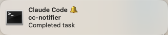

# cc-notifier 🔔

**Smart Notifications for Claude Code on Desktop and Mobile**

Click notifications to instantly restore your exact Claude Code context across macOS Spaces—not just the app, but your specific terminal/IDE window (and iTerm2 tab when available).

Also enables seamless 📱 mobile development via push notifications.

## Features

- **🎯 Click-to-Focus** - Restore exact window across Spaces, not just the app. With iTerm2, cc-notifier also restores the original tab/session within that window.
- **🧠 Intelligent Detection** - 💻 Desktop: notifies when you switch windows | 🌐 Remote: notifies when idle
- **⚡ Fast & Async** - Runs in background, never blocks Claude Code
- **📲 Push Notifications** - Desktop: optional idle alerts | Remote: primary notification method (Pushover)
- **📱 Mobile Handoff** - (Optional) Desktop→phone workflow via Blink Shell

## Quick Start

### Desktop Mode

```bash
# Install dependencies
brew install --cask hammerspoon
brew install terminal-notifier

# Configure Hammerspoon (~/.hammerspoon/init.lua)
require("hs.ipc")
require("hs.window")
require("hs.window.filter")
require("hs.timer")

# Reload: hs -c "hs.timer.doAfter(0, hs.reload)"

# Install cc-notifier
git clone https://github.com/trentmcnitt/cc-notifier.git
cd cc-notifier
./install.sh
```

Add hooks to `~/.claude/settings.json` (see Configuration below).

## Configuration

Add to `~/.claude/settings.json`:

```json
{
  "hooks": {
    "SessionStart": [
      {
        "matcher": "*",
        "hooks": [
          {
            "type": "command",
            "command": "$HOME/.cc-notifier/cc-notifier init"
          }
        ]
      }
    ],
    "Stop": [
      {
        "matcher": "*",
        "hooks": [
          {
            "type": "command",
            "command": "$HOME/.cc-notifier/cc-notifier notify"
          }
        ]
      }
    ],
    "Notification": [
      {
        "matcher": "permission_prompt|elicitation_dialog",
        "hooks": [
          {
            "type": "command",
            "command": "$HOME/.cc-notifier/cc-notifier notify"
          }
        ]
      }
    ],
    "SessionEnd": [
      {
        "matcher": "*",
        "hooks": [
          {
            "type": "command",
            "command": "$HOME/.cc-notifier/cc-notifier cleanup"
          }
        ]
      }
    ]
  },
  // Optional: Push notifications (requires Pushover account)
  "env": {
    "PUSHOVER_API_TOKEN": "your_pushover_app_token",
    "PUSHOVER_USER_KEY": "your_pushover_user_key"
  }
}
```

## How It Works

### 💻 Desktop Mode

1. **Session Start** → Captures your focused window ID
2. **Task Completion** → Compares current window vs original window
3. **Smart Notification:**
   - 🪟 **Switched windows?** → Local notification with click-to-focus
   - 🗂️ **Switched iTerm2 tabs in same window?** → Local notification with tab-aware click-to-focus
   - 💤 **Idle at desk?** → Optional push notification via Pushover
4. **Click Notification** → Hammerspoon restores your exact window across Spaces; iTerm2 sessions also restore the original tab

### 🌐 Remote Mode (SSH)

1. **Auto-Detection** → Detects SSH via `SSH_CONNECTION` environment variable
2. **Session Start** → Skips window tracking (uses placeholder)
3. **Task Completion** → Checks TTY idle time (st_atime)
4. **Smart Notification:**
   - 💤 **User idle?** → Push notification with resume URL
   - ⚡ **User active?** → No notification
5. **Tap Notification** → Pushover opens → Tap URL → Blink Shell auto-resumes session

**🔧 Tested Stack:** [Tailscale](https://github.com/tailscale/tailscale) + [mosh](https://github.com/mobile-shell/mosh) + [tmux](https://github.com/tmux/tmux) + [Blink Shell](https://github.com/blinksh/blink)

---




---

## 📱 Mobile Development

**Start coding on your desktop, continue seamlessly on your phone.**

When Claude Code completes a task and you're away from your desk, you'll get a push notification. Tap it to instantly resume your exact conversation in Blink Shell.

### Workflow

1. 💻 Start coding task on desktop
2. 🚶 Walk away from computer
3. 📲 Push notification arrives on your phone
4. 👆 Tap notification → Pushover opens
5. 🔗 Tap URL → Blink Shell opens
6. ⚡ Auto-resumes exact Claude Code session

**📖 Complete Setup Guide:** [Mobile workflow documentation →](mobile/)

### Configuration Example

Add to `~/.claude/settings.json` (extends the Configuration section above):

```json
{
  "env": {
    "PUSHOVER_API_TOKEN": "your_token",
    "PUSHOVER_USER_KEY": "your_key",
    "CC_NOTIFIER_PUSH_URL": "blinkshell://run?key=YOUR_KEY&cmd=mosh mbp -- ~/bin/mosh-cc-resume.sh {session_id} {cwd}"
  }
}
```

**Placeholders** (auto-replaced at runtime):
- `{session_id}` → Claude Code session ID
- `{cwd}` → Current working directory

## Troubleshooting

**Debug Mode:**

Enable detailed logging for troubleshooting:

```json
{
  "hooks": {
    "SessionStart": [{
      "matcher": "*",
      "hooks": [{
        "type": "command",
        "command": "$HOME/.cc-notifier/cc-notifier --debug init"
      }]
    }]
    // Add --debug to all other hooks (notify, cleanup)
  }
}
```

**Debug mode features:**
- File logging with timestamps: `~/.cc-notifier/cc-notifier.log`
- Desktop: "[DEBUG]" prefix on notifications
- Remote: Precise timestamps on push notifications
- Logs: Hook events, window IDs, idle checks, notification sends

**View logs:**
```bash
tail -f ~/.cc-notifier/cc-notifier.log  # Follow in real-time
cat ~/.cc-notifier/cc-notifier.log      # View entire log
```

**Disable:** Remove `--debug` flag from hook commands in settings.json

---

**Wrong window focused:**
- Window ID captured at session start
- Solution: Restart Claude Code or clear/resume session
- Prevention: Keep Claude focused when starting sessions

**Mac sleep interrupts tasks:**
```bash
sudo pmset -g                # Check settings
sudo pmset -c sleep 0        # Disable while plugged in
caffeinate -i                # Temporary prevention
```

**Hammerspoon window discovery:**
- Visit Spaces and click windows after Hammerspoon restart
- Auto-populates during normal use

**Window focus issues:**
- Try closing and re-opening the terminal/IDE window
- Apps can get into states where Hammerspoon can't focus them

## Known Limitations

**Tmux "attached" does not mean "viewing":** When Hammerspoon is unavailable (e.g., remote mode without window tracking), cc-notifier uses tmux session attachment status as a proxy for whether you're looking at Claude Code output. However, a tmux session being attached only means a terminal client is connected—you could be looking at a completely different tmux window or pane. This can lead to false notification suppression if you have complex multi-window tmux setups.

## Development

```bash
python3 -m venv .venv
source .venv/bin/activate
make install
pre-commit install
make check  # format, lint, typecheck, test
```

Contributing: Fork, `make check`, test, PR.

**Project structure:**
```
~/.cc-notifier/         # Installation
├── cc-notifier         # Entry point
└── cc_notifier.py      # Implementation

mobile/                 # Mobile workflow
├── README.md
├── mosh-cc-resume.sh
└── tmux-idle-cleanup.sh
```

## License

MIT
