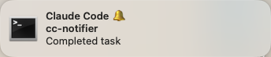

# cc-notifier 🔔

[](https://github.com/trentmcnitt/cc-notifier/actions/workflows/ci.yml)
[](https://github.com/trentmcnitt/cc-notifier/releases/latest)
[](LICENSE)
[](pyproject.toml)

**Notifications for [Claude Code](https://code.claude.com/docs/en/overview) that take you back to the exact window you left.**

When Claude Code finishes a task or needs your permission while you're working in another window, cc-notifier shows a macOS notification. Click it and you're back in the original terminal or IDE window, even on another Space (and the same tab, in iTerm2). Away from your desk? It sends a push notification to your phone instead, which can reopen the session there.



## Features

- **🎯 Click-to-focus across Spaces.** Returns you to the exact window, not just the app, and to the original iTerm2 tab.
- **🧠 Only when you've looked away.** Local notifications fire only if you switched windows, iTerm2 tabs, or tmux sessions. Over SSH, cc-notifier checks whether you're idle instead.
- **📲 Push when you're away.** Optional Pushover notifications when you've been idle at your desk; the main channel over SSH.
- **📱 Phone handoff (optional).** Tap the push notification to resume the same session in Blink Shell.
- **⚡ Never blocks Claude Code.** Hooks return immediately and the work runs in the background.
- **🪶 Small and dependency-free.** One standard-library Python file plus a bash wrapper, tested in CI on Python 3.9 through 3.14.

## How It Works

### 💻 Desktop Mode

1. **Session Start** → Captures your focused window ID
2. **Task Completion** → Compares current window vs original window
3. **Smart Notification:**
   - 🪟 **Switched windows?** → Local notification with click-to-focus
   - 🗂️ **Switched iTerm2 tabs in same window?** → Local notification with tab-aware click-to-focus
   - 💤 **Idle at desk?** → Optional push notification via Pushover
4. **Click Notification** → Hammerspoon restores your exact window across Spaces; iTerm2 sessions also restore the original tab

### 🌐 Remote Mode (SSH)

1. **Auto-Detection** → Detects SSH via `SSH_CONNECTION` environment variable
2. **Session Start** → Skips window tracking (uses placeholder)
3. **Task Completion** → Checks TTY idle time (st_atime)
4. **Smart Notification:**
   - 💤 **User idle?** → Push notification with resume URL
   - ⚡ **User active?** → No notification
5. **Tap Notification** → Pushover opens → Tap URL → Blink Shell auto-resumes session

**🔧 Tested Stack:** [Tailscale](https://github.com/tailscale/tailscale) + [mosh](https://github.com/mobile-shell/mosh) + [tmux](https://github.com/tmux/tmux) + [Blink Shell](https://github.com/blinksh/blink)

## Requirements

- **macOS** for desktop mode (Apple Silicon or Intel)
- **Python 3.9+**, standard library only. The `python3` that ships with macOS works.
- **[Hammerspoon](https://www.hammerspoon.org/)** with **Accessibility permission** (System Settings → Privacy & Security → Accessibility → enable Hammerspoon). Without it, Hammerspoon can't see or focus windows, so click-to-focus and switched-away detection won't work.
- **[terminal-notifier](https://github.com/julienXX/terminal-notifier)** for local notifications
- **[Pushover](https://pushover.net/)** account (optional on desktop; required in remote mode, where push is the only notification method)

## Quick Start

### Desktop Mode

```bash
# Install dependencies
brew install --cask hammerspoon
brew install terminal-notifier
```

**Launch Hammerspoon for the first time and install its CLI** (required — the `hs` command is a shim that talks to a running Hammerspoon, and the symlink doesn't exist until you ask for it):

1. Open Hammerspoon.app and grant Accessibility permission when prompted (or later in System Settings → Privacy & Security → Accessibility).
2. Open the Hammerspoon console (click the menu bar icon → Console).
3. Run: `hs.ipc.cliInstall()`

Then configure Hammerspoon (`~/.hammerspoon/init.lua`):

```lua
require("hs.ipc")
require("hs.window")
require("hs.window.filter")
require("hs.timer")
```

Reload Hammerspoon:

```bash
hs -c "hs.timer.doAfter(0, hs.reload)"
```

> If this command hangs, Hammerspoon isn't running or the CLI wasn't installed — repeat the launch + `hs.ipc.cliInstall()` step above.

Install cc-notifier:

```bash
git clone https://github.com/trentmcnitt/cc-notifier.git
cd cc-notifier
./install.sh
```

Add hooks to `~/.claude/settings.json` (see Configuration below).

## Configuration

Add to `~/.claude/settings.json`:

```json
{
  "hooks": {
    "SessionStart": [
      {
        "matcher": "startup|resume|clear|fork",
        "hooks": [
          {
            "type": "command",
            "command": "$HOME/.cc-notifier/cc-notifier init"
          }
        ]
      }
    ],
    "Stop": [
      {
        "hooks": [
          {
            "type": "command",
            "command": "$HOME/.cc-notifier/cc-notifier notify"
          }
        ]
      }
    ],
    "Notification": [
      {
        "matcher": "permission_prompt|elicitation_dialog",
        "hooks": [
          {
            "type": "command",
            "command": "$HOME/.cc-notifier/cc-notifier notify"
          }
        ]
      }
    ],
    "SessionEnd": [
      {
        "matcher": "*",
        "hooks": [
          {
            "type": "command",
            "command": "$HOME/.cc-notifier/cc-notifier cleanup"
          }
        ]
      }
    ]
  },
  // Optional: Push notifications (requires Pushover account)
  "env": {
    "PUSHOVER_API_TOKEN": "your_pushover_app_token",
    "PUSHOVER_USER_KEY": "your_pushover_user_key"
  }
}
```

**Why the SessionStart matcher lists sources:** `init` records whichever window is focused when it runs. SessionStart also fires on `compact` (auto or manual compaction), which isn't a new session. The matcher skips `compact`, and `init` ignores compaction anyway, so older configs using `"*"` are also safe. Keep `fork`: a forked session is a new session and needs its own `init`.

`Stop` doesn't support matchers, so it has none. For the `Notification` hook, other useful matcher values include `idle_prompt` and `elicitation_url_dialog` (see the [hooks reference](https://code.claude.com/docs/en/hooks)).

## Options

### Command-line flags

Add these to the hook `command` strings:

| Flag | Effect |
|------|--------|
| `--icon <path>` | Show a PNG in local notifications (terminal-notifier's `contentImage`). Use it on `notify` hooks, e.g. `$HOME/.cc-notifier/cc-notifier notify --icon $HOME/.claude/hooks/my-icon.png`. Ignored if the file doesn't exist. |
| `--debug` | Log to `~/.cc-notifier/cc-notifier.log` and mark notifications as debug. See [Troubleshooting](#troubleshooting). |

### Environment variables

Set these in the `env` block of `~/.claude/settings.json`:

| Variable | Effect |
|----------|--------|
| `PUSHOVER_API_TOKEN`, `PUSHOVER_USER_KEY` | Enable push notifications via Pushover |
| `CC_NOTIFIER_TITLE_FORMAT` | Custom title for local and push notifications, e.g. `"{hostname}: {dir}"`. When unset, local notifications use "Claude Code 🔔" and push notifications use the directory name. |
| `CC_NOTIFIER_PUSH_URL` | URL attached to push notifications, e.g. to resume the session on your phone. See [Mobile Development](#-mobile-development). |

### Placeholders

Both `CC_NOTIFIER_TITLE_FORMAT` and `CC_NOTIFIER_PUSH_URL` accept these:

| Placeholder | Value |
|-------------|-------|
| `{dir}` | Name of the working directory (e.g. `cc-notifier`) |
| `{cwd}` | Full working directory path |
| `{hostname}` | Machine hostname |
| `{tmux_session}` | tmux session name (empty outside tmux) |
| `{env:VAR}` | Value of environment variable `VAR` (empty if unset) |
| `{session_id}` | Claude Code session ID (`CC_NOTIFIER_PUSH_URL` only) |

## 📱 Mobile Development

**Start coding on your desktop, continue seamlessly on your phone.**

When Claude Code completes a task and you're away from your desk, you'll get a push notification. Tap it to instantly resume your exact conversation in Blink Shell.


### Workflow

1. 💻 Start coding task on desktop
2. 🚶 Walk away from computer
3. 📲 Push notification arrives on your phone
4. 👆 Tap notification → Pushover opens
5. 🔗 Tap URL → Blink Shell opens
6. ⚡ Auto-resumes exact Claude Code session

**📖 Complete Setup Guide:** [Mobile workflow documentation →](mobile/)

### Configuration Example

Add to `~/.claude/settings.json` (extends the Configuration section above):

```json
{
  "env": {
    "PUSHOVER_API_TOKEN": "your_token",
    "PUSHOVER_USER_KEY": "your_key",
    "CC_NOTIFIER_PUSH_URL": "blinkshell://run?key=YOUR_KEY&cmd=mosh mbp -- ~/bin/mosh-cc-resume.sh {session_id} {cwd}"
  }
}
```

`{session_id}` and `{cwd}` are replaced at runtime. See [Placeholders](#placeholders) for the full list.

## Troubleshooting

**Debug Mode:**

Enable detailed logging for troubleshooting:

```json
{
  "hooks": {
    "SessionStart": [{
      "matcher": "startup|resume|clear|fork",
      "hooks": [{
        "type": "command",
        "command": "$HOME/.cc-notifier/cc-notifier --debug init"
      }]
    }]
    // Add --debug to all other hooks (notify, cleanup)
  }
}
```

**Debug mode features:**
- File logging with timestamps: `~/.cc-notifier/cc-notifier.log`
- Desktop: "[DEBUG]" prefix on notifications
- Remote: Precise timestamps on push notifications
- Logs: Hook events, window IDs, idle checks, notification sends

**View logs:**
```bash
tail -f ~/.cc-notifier/cc-notifier.log  # Follow in real-time
cat ~/.cc-notifier/cc-notifier.log      # View entire log
```

**Disable:** Remove `--debug` flag from hook commands in settings.json

---

**Wrong window focused:**
- Window ID captured at session start
- Solution: Restart Claude Code or clear/resume session
- Prevention: Keep Claude focused when starting sessions

**Mac sleep interrupts tasks:**
```bash
sudo pmset -g                # Check settings
sudo pmset -c sleep 0        # Disable while plugged in
caffeinate -i                # Temporary prevention
```

**Hammerspoon window discovery:**
- Visit Spaces and click windows after Hammerspoon restart
- Auto-populates during normal use

**Window focus issues:**
- Check that Hammerspoon has Accessibility permission (System Settings → Privacy & Security → Accessibility)
- Try closing and re-opening the terminal/IDE window
- Apps can get into states where Hammerspoon can't focus them

## Known Limitations

**Tmux "attached" does not mean "viewing":** When Hammerspoon is unavailable (e.g., remote mode without window tracking), cc-notifier uses tmux session attachment status as a proxy for whether you're looking at Claude Code output. However, a tmux session being attached only means a terminal client is connected—you could be looking at a completely different tmux window or pane. This can lead to false notification suppression if you have complex multi-window tmux setups.

## Design Notes

Focusing a specific window on another macOS Space is harder than it sounds: AppleScript can't see windows on other Spaces, and there's no reliable way to link a shell to its window. [docs/RESEARCH_LOG.md](docs/RESEARCH_LOG.md) records what was tried, what failed, and the dual-filter Hammerspoon approach cc-notifier uses.

## Development

```bash
python3 -m venv .venv
source .venv/bin/activate
make install
pre-commit install
make check  # format, lint, typecheck, test
```

See [CONTRIBUTING.md](CONTRIBUTING.md) for the workflow.

**Installed layout:**
```
~/.cc-notifier/         # Installation
├── cc-notifier         # Entry point
└── cc_notifier.py      # Implementation

mobile/                 # Mobile workflow
├── README.md
├── mosh-cc-resume.sh
└── tmux-idle-cleanup.sh
```

## Contributors

Thanks to everyone who has contributed:

- [@lamdor](https://github.com/lamdor) (Luke Amdor): custom notification titles, graceful handling of a missing Hammerspoon, and tmux session tracking
- [@dgokcin](https://github.com/dgokcin) (Deniz Gökçin): iTerm2 tab-level notifications and click-to-focus
- [@wozniakos10](https://github.com/wozniakos10) (Dawid Woźniak): the `--icon` flag for custom notification images

## License

MIT. See [LICENSE](LICENSE).
